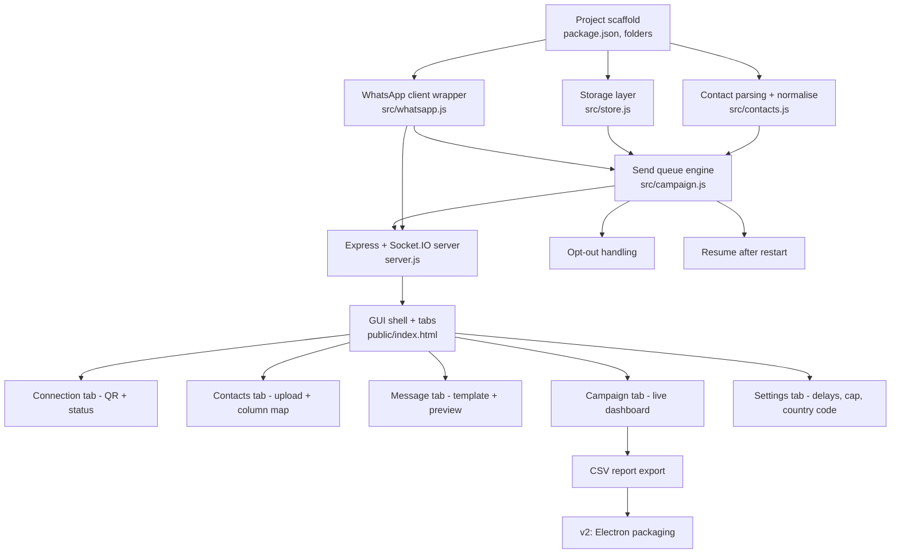

# PROGRESS / CONTEXT — WhatsApp Bulk Sender

Purpose: so any new session (human or Claude) can pick this up without re-reading the whole
codebase. Read this + `PRD.md` first. Update the checkboxes and the "Session log" as you go.

**Last updated:** 2026-09-21

---

## One-paragraph summary

Local Node.js app. `whatsapp-web.js` drives a headless Chromium that is logged into the user's
own WhatsApp Web session. An Express server serves a plain-HTML GUI on `localhost:3000` and
pushes QR codes, progress and logs over Socket.IO. The user uploads a CSV/XLSX contact list,
maps columns, writes a templated message, and a sequential queue sends it with randomised
delays, a daily cap and an opt-out list. All state lives in JSON files under `data/`.

## Work graph

## Status

### Done
- [x] PRD written (`PRD.md`)
- [x] This context doc
- [x] Folder scaffold (`src/ public/ data/ uploads/ sessions/`)
- [x] `package.json` + dependencies installed
- [x] `src/store.js` — JSON persistence
- [x] `src/contacts.js` — CSV/XLSX/paste parsing, number normalisation, dedupe
- [x] `src/template.js` — `{{var}}` + spintax rendering
- [x] `src/whatsapp.js` — client lifecycle, QR, ready, number check, send
- [x] `src/campaign.js` — queue, delays, pause/resume/stop, retry, daily cap
- [x] `server.js` — REST + Socket.IO
- [x] `public/` — GUI (all five tabs)
- [x] `README.md` — run instructions

- [x] `start.bat` double-click launcher
- [x] Tested: number normalisation (10 cases), send engine with a stubbed transport
      (sent / failed / retry-once / not-on-WhatsApp / opt-out), pause + resume across a
      process restart, daily-cap stop, CSV report, history archive
- [x] Tested: real Chromium launch and live QR generation
- [x] Tested: GUI renders and all tabs work (driven with Puppeteer, zero console errors)

### Not done / next
- [ ] **End-to-end test with a real WhatsApp account** — everything up to the QR is verified,
      but no message has actually been delivered yet. Needs the user's phone to scan.
- [ ] Inbound STOP listener verified against a real reply
- [ ] Electron packaging (v2)
- [ ] Scheduled sends (v2)

## Bugs found and fixed during the build

| Bug | Symptom | Fix |
|---|---|---|
| `[hidden]` did nothing | A CSS `display` rule beats the `hidden` attribute's UA style, so the first-run warning modal stayed on screen as a full-viewport overlay after "Continue" and silently swallowed every click in the app | `[hidden] { display: none !important; }` at the top of `styles.css` |
| Country code skipped | A 10-digit national number that happens to start with the country code (`9123456789` with cc `91`) was treated as already-international and sent malformed | Require `cc.length + 9` digits before treating a number as international |
| No nav below 950px | The sidebar was `display: none` with no replacement, leaving no way to change tabs on a narrow window | Sidebar becomes a horizontal scrolling bar |
| Chromium never downloaded | `npm install` did not fetch Chromium, so connecting failed with "Could not find Chrome" | `postinstall: puppeteer browsers install chrome` |

## Key decisions and why

| Decision | Reason |
|---|---|
| `whatsapp-web.js` over the official Cloud API | Cloud API needs business verification + paid templates; user wants their personal number |
| JSON files over SQLite | `better-sqlite3` needs node-gyp/VS build tools on Windows — a install-time failure mode for a non-technical user |
| Browser GUI over Electron | Same UI, no build step, no 200 MB download. Electron is a packaging concern, deferred |
| Sequential queue, never parallel | Parallel sends from one session are the fastest route to a ban |
| Spintax built in | Identical message bodies at volume is the strongest spam signal WhatsApp has |
| Session stored via `LocalAuth` in `sessions/` | Avoids re-scanning QR on every restart |

## Gotchas for whoever picks this up

- `sessions/` and `data/` contain the live WhatsApp auth and contact data. **Never commit them.**
  `.gitignore` covers this.
- If Chromium fails to launch, `whatsapp-web.js` fails silently-ish — check the terminal, not the GUI.
  Fallback: set `CHROME_PATH` env var to a local Chrome install.
- WhatsApp Web updates occasionally break `whatsapp-web.js`. Symptom: stuck on "authenticating"
  forever. Fix: `npm install whatsapp-web.js@latest` and delete `sessions/`.
- Number normalisation assumes a default country code from settings (default `91`). A list with
  mixed countries must carry full international numbers.
- The daily cap counter resets on calendar date, stored in `data/settings.json`.

## Session log

- **2026-09-21** — Project created from scratch. PRD + this doc + full v1 implementation
  (backend, engine, GUI). Engine, parsing and GUI verified with automated tests and a
  Puppeteer-driven browser; real Chromium launch and QR generation confirmed. Four bugs
  found and fixed (table above). **Still untested: an actual message delivered to a real
  phone** — that is the first thing to do next, with a 2-contact list of your own numbers.
